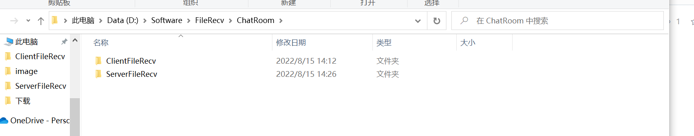

# gitstudy

#### 介绍
这个人很懒......

#### 软件架构
我也不知道瞎敲的

#### 安装教程

1.  JDK8
2.  IDEA
3.  MySQL
4.  JavaFX

#### 使用说明
======记得把客户端仓库和服务端仓库建一下，俺用的绝对路径=====
D:\Software\FileRecv\ChatRoom\ClientFileRecv
D:\Software\FileRecv\ChatRoom\ServerFileRecv

