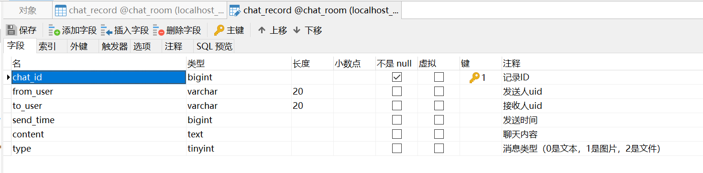

# JavaSE_ChatRoom

#### 介绍
一个基于JavaSE中初级语法、面向对象、IO流、多线程，JDBC，TCP协议，MySQL，JavaFX的聊天室项目。

#### 软件架构
MVC三层架构

#### 安装教程

1.  JDK8
2.  IDEA
3.  MySQL
4.  JavaFX

#### 使用说明（完结篇）
========记得把客户端仓库和服务端仓库建一下，俺用的绝对路径=======
D:\Software\FileRecv\ChatRoom\ClientFileRecv
D:\Software\FileRecv\ChatRoom\ServerFileRecv

#### 示例

